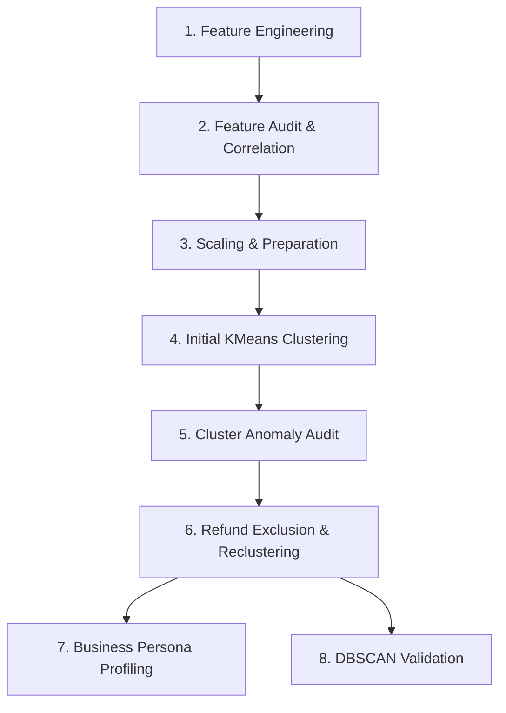

# Customer Segmentation Pipeline

This document describes the execution sequence and workflow of the Customer Segmentation module in the RetailPulse platform. The pipeline progresses from feature engineering and data auditing to clustering, anomaly filtering, persona profiling, and validation.

## Pipeline Order & Execution Flow

---

### Step 1: Feature Engineering
* **Source Script**: `engineer_features.py` (located in project root)
* **Description**: Processes the raw transaction records to aggregate customer-level behavioral metrics.
* **Output**: `customer_features.csv`

### Step 2: Feature Audit & Correlation Analysis
* **Script**: `feature_audit.py`
* **Description**: Inspects distributions, identifies null values, handles infinite values, checks for skewness, and computes correlations between features.
* **Outputs**: `correlation_matrix.csv`, `customer_features_cleaned.csv`

### Step 3: Scaling & Dataset Preparation
* **Script**: `prepare_segmentation_dataset.py`
* **Description**: Applies log-transformations to highly skewed metrics and compares scaling techniques (`StandardScaler` vs. `RobustScaler`).
* **Outputs**: `clustering_dataset_std.csv`, `clustering_dataset_rob.csv`

### Step 4: Initial KMeans Clustering
* **Scripts**: `kmeans_segmentation.py`, `run_kmeans.py`, `compare_k4.py`, `dump_means.py`
* **Description**: Performs elbow method and silhouette score analysis. Computes clustering solutions with and without the optional `active_months` feature.
* **Output**: `customer_segments_kmeans.csv`

### Step 5: Cluster Anomaly Audit
* **Script**: `audit_cluster_1.py`
* **Description**: Validates a small, peculiar cluster (Cluster 1) showing extremely low spending and long recency. Discovers that these are cancellation/refund-heavy accounts rather than representative low-value customers.
* **Output**: Detailed audit report revealing data quality/refund artifacts.

### Step 6: Refund Exclusion & Reclustering
* **Script**: `remove_refunds_and_recluster.py`
* **Description**: Filters out refund-dominated customers (net zero/negative spend or heavy cancellations), then scales and runs the finalized K-Means model (K=3).
* **Outputs**: 
  - `customers_features_no_refunds.csv`
  - `customers_features_finalone.csv`
  - `clustering_dataset_std_v2.csv`
  - `customer_segments_kmeans_finalone.csv` (approved final segments)

### Step 7: Business Persona Profiling
* **Script**: `extract_cluster_stats.py`
* **Description**: Aggregates final segment averages and translates raw centroids into distinct business personas (VIP Loyal Customers, Value Shoppers, Occasional Shoppers).
* **Output**: Final comparative business intelligence report.

### Step 8: DBSCAN Validation & Outlier Detection
* **Script**: `dbscan_analysis.py`
* **Description**: Applies DBSCAN clustering to the finalized standardized dataset using optimal parameter search (Epsilon = 1.8, Min Samples = 10) to validate KMeans boundaries and flag genuine anomalous users.
* **Output**: `customer_segments_dbscan.csv`
